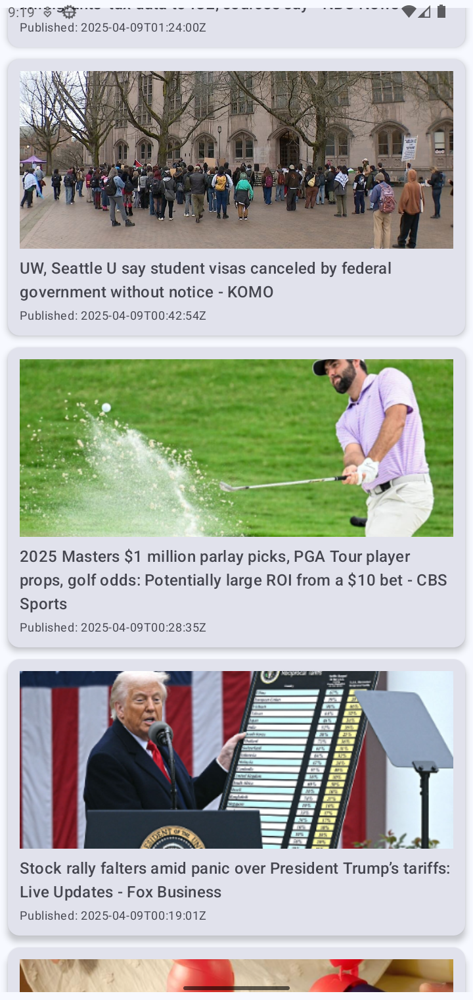
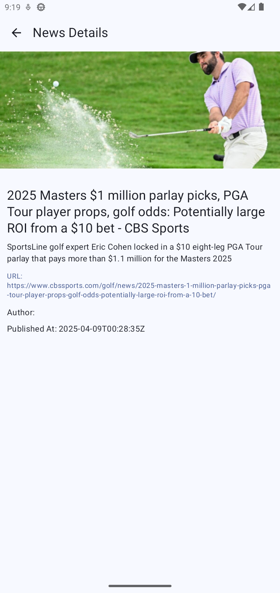

# News App - Jetpack Compose + Clean Architecture

This is a sample Android News App built using Jetpack Compose and following modern **Clean Architecture** principles. It showcases best practices in modular Android app development using **multiple modules** for better separation of concerns, scalability, and testability.

---

## Features

- Display news headlines in a scrollable list
- Pagination with **Paging 3**
- Offline caching using **Room** and **RemoteMediator**
- View details on a separate screen
- Shared ViewModel between screens
- Modern UI using **Jetpack Compose**
- **Hilt** for Dependency Injection
- **Clean Architecture** with Domain layer
- **Unit tested** Repository, usecase and viewModel

---

## Tech Stack
- **Jetpack Compose** - Modern UI toolkit
- **MVVM + Clean Architecture** - Scalable app architecture
- **Paging 3** - Efficient pagination and data loading
- **Room** - Local database with caching support
- **Retrofit** - Type-safe network client
- **Hilt** - Dependency injection
- **Navigation Compose** - Type-safe navigation
- **Coroutines & Flow** - Async and reactive programming
- **Coil** - Image loading
- **MockK** - Testing library for mocks
- **Robolectric** - JVM-based unit testing

---

## Best Practices Followed

-  **Multi-module Clean Architecture** for separation of concerns
-  **StateFlow** for reactive state management
-  Shared **ViewModel** across composables
-  Safe argument passing using **encoded navigation arguments**
-  Unit testing for `Repository`, `UseCase`, and `ViewModel`
-  Use of **sealed classes**, **type safety**, and idiomatic **Kotlin**

  ---

## Improvement planned

- **Add full UI tests using androidx.compose.ui.test**
- **Improve error handling and add retry actions**
- **Replace Log.d with Timber**
- **Hide API key using secure storage or environment configs**
- **Add KDoc comments and more documentation**

  ---

  ## App Screenshots

  
  &nbsp;&nbsp;
  

- 

